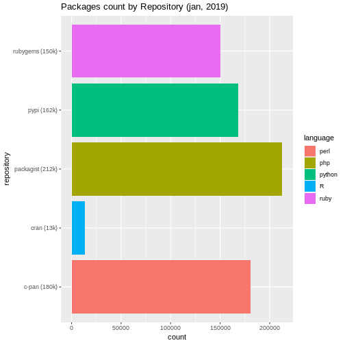
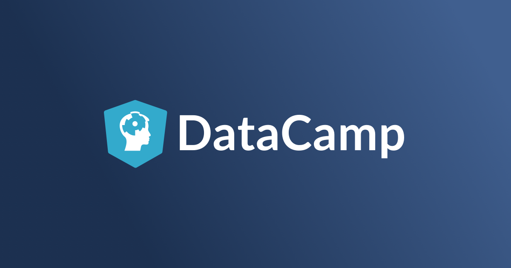

Análise Reprodutível em R
========================================================
author: Wagner Pinheiro
date: Fevereiro de 2019
autosize: true
css:press.css

Sobre Mim
========================================================

- Formado em Engenharia da Computação (+Física +Téc. TI)
- + 15 anos de experiência Dev + Ops
- 5 anos na Mandic

----

- certificações:
 - Furukawa Certified Professional
 - Itil v3
 - PSM-I
 - J.H. Data Science Specialization (Coursera)
 - AWS Developer Assoc.
 - AWS Architect Assoc.
 - AWS DevOps Pro
 - Padi AOWD (We Are Explorers!)

Agenda
========================================================

Agenda: DATA SCIENCE (com R)
========================================================

 

- história R
- estatística
- análise de causa raiz
- ciclo de vida data science
- pipeline data science
- relatórios descritivos no RStudio (how-to e exemplos)

----

Status quo (?)
========================================================

Estatística
========================================================

Estatística Descritiva x Inferencial 

----

Correlação não implica em causalidade

Diagrama de Causa e Efeito: Ishikawa
========================================================

R - História
========================================================

Utilizado por estatísticos, analistas de dados, data miners e pesquisadores.

<iframe scrolling="no" src="demo.html" style="position:absolute;height:400px;width:100%; "></iframe>

Gerenciamento de Pacotes
========================================================

Repositórios:

- R: Cran
- Python: Pypi

----

Gerenciamento: 
- R: Packart
- Python: pip + Virtualenv

CRAN - Bibliotecas R
========================================================

- SQL
- CSV
- txt
- RZABBIX
- RCHEF
- RGoogleAnalytics
- JsonLite
- cloudyr

----

Dúvida: Por que R e não Python?
========================================================

----

    Python xOR JAVA xOR .NET xOR Excel 
    
    xOR 
    
    [coloque sua linguagem preferida aqui!]
    

Data Science Lifecycle
========================================================

Data Science Pipeline
========================================================

- Obter + Limpar -> ETL (Extract, Transform, Load) [DWH & B.I.]

AWS Data Pipeline

How-to: ggplot2
========================================================

- [Top50 GGplot2 Visualizations](http://r-statistics.co/Top50-Ggplot2-Visualizations-MasterList-R-Code.html#Ordered%20Bar%20Chart)

Relatórios Descritivos e Apps em Shiny
========================================================

- Status Gerenciamento de Configuração
- [Vítimas de Trânsito em São Paulo 2015](https://wagnerpinheiro.shinyapps.io/traffic_accidents_in_so_paulo_-_2015/)
- [IT Networking Hub](http://itnh.wagnerpinheiro.com.br)

Outras Ferramentas
========================================================

- Stack ELK (Logstash + Elasticsearch + Kibana) / Graylog
- AWS Cloudwatch / Logs / CloudTrail
- AWS Quicksights
- AWS SageMaker

Como começar?
========================================================

- [Data Scientist with R](https://www.datacamp.com/tracks/data-scientist-with-r)
- [Importing data in R](https://www.datacamp.com/courses/importing-data-in-r-part-1)
- [Intro to Python for data science](https://www.datacamp.com/courses/intro-to-python-for-data-science)

----

Perguntas?
========================================================

Obrigado!
========================================================

 
 

Wagner S. Pinheiro

DevOps Engineer

https://www.linkedin.com/in/wagnerspinheiro/

Links
========================================================

- [Top50 GGplot2 Visualizations](http://r-statistics.co/Top50-Ggplot2-Visualizations-MasterList-R-Code.html#Ordered%20Bar%20Chart)
- [Vítimas de Trânsito em São Paulo 2015](https://wagnerpinheiro.shinyapps.io/traffic_accidents_in_so_paulo_-_2015/)
- [IT Networking Hub](http://itnh.wagnerpinheiro.com.br)
- [data scientist with r](https://www.datacamp.com/tracks/data-scientist-with-r)
- Quicksights

